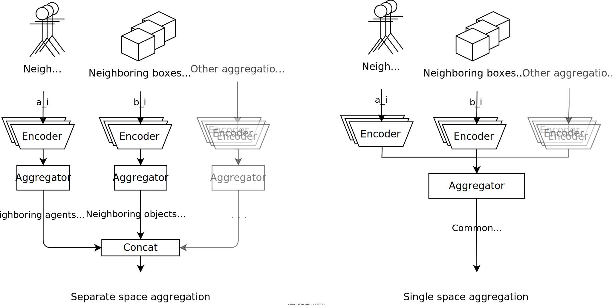

## Results {#sec:results}

In this section, we present the results of our experiments. We compare (1) the
training performance of the different aggregation methods on various tasks, (2)
aggregating different observation sets into a single vs multiple latent spaces
(3) various variants of Bayesian aggregation (4) PPO with TRL.

In order to compare the performance of different variants, we consider the
average reward per episode over the agent steps used during training. This way
we can evaluate and compare the overall best results as well as the sample
efficiency.

Each policy gradient training step consists of a set of batches of trajectory
rollouts generated using the previous policy. We evaluate the performance after
each training step on a separate set of evaluation environments.

Unless mentioned otherwise, the following setup is used:

- Plotted is the median of the n runs, the error band is the 25th and 75th
  percentile of runs.

### Aggregation method results

We compare the performance of the different aggregation methods (Bayesian
aggregation, mean aggregation, attentive aggregation) on multiple tasks.

We use the notation `64-agg-64` to describe the layer sizes of the neural
network: The numbers before `agg` are the sequential layer sizes of the dense
layers of the encoders of each aggregation group. The numbers after `agg` are
the layer sizes in the decoder after the concatentation of the proprioceptive
observations with the aggregated observations (compare @fig:model).

#### Multi-evader pursuit task

Here we consider the multi-evader pursuit task with 20 pursuers and 5 evaders on
a torus. @Fig:resmpsmall shows the results of the multi-evader pursuit task with
different aggregation methdos with the same architecture used in [@maxpaper] to
be able to directly compare the results. The architecture is 64-agg-64 with the
tanh activation function. With this architecture, the Bayesian aggregation
performs best.

![Results on the multi-evader pursuit task with the NN architecture adapted from
[@maxpaper]. The Bayesian aggregation performs
best.](images/plots/2021-07-10_13.30.06-Multi-Evader Pursuit
(smallarch).svg){#fig:resmpsmall}

@Fig:resmpopt shows the results with the neural network architectures separately
hyper-parameter optimized on the task. The optimized architecture for the mean
aggregation is `174-226-97-agg-96` with LeakyReLU activation functions. The
optimized architecture for the Bayesian aggregation is `120-60-agg-160` with
LeakyReLU activation functions. The optimized architecture for the attentive
aggregation is `72-agg-132-200`. Note that the architecture optimized on the
mean aggregation is the deepest with three hidden layers before the aggregation,
while the optimized architecture on the attentive aggregation has multiple
layers after the aggregation instead. With the hyper-parameter optimized
architecture, the mean aggregation performs best. The results are still similar
when using the `120-60-agg-160` architecture for every aggregation method. These
results indicate that the Bayesian aggregation outperforms the mean aggregation
when the neuronal network is limited in size, but has no advantage when the
neural network is sufficiently large and deep. The neural network seems to be
able to implicitly learn to transform and weigh the information from the
different observables, compensating the advantage of the additional structure of
relevancy / certainty that is given in the Bayesian aggregation.

.svg){#fig:resmpopt}

.svg){#fig:resmpopttop}

#### Single-evader pursuit task

@Fig:ressp shows the results on the single-evader pursuit task with 10 pursuers
and one evader.

{#fig:ressp}

#### Rendezvous task

@Fig:resrendezvous.

{#fig:resrendezvous}

#### Assembly task

@Fig:resassembly shows the results on the assembly task with ten agents and four
boxes. The three aggregation methods perform very similar, with the attentive
aggregation learning the task slightly quicker.

.svg){#fig:resassembly}

#### Clustering task with two clusters

@Fig:resclustering2 shows the results on the clustering task with four boxes
split into two clusters.

.svg){#fig:resclustering2}

#### Clustering task with three clusters

Doesn't work :(

### Max aggregation

@Fig:resaggmax shows a comparison between mean-aggregation and max-aggregation
on the multi-evader pursuit task.

{#fig:resaggmax}

### Learning algorithm comparison (PPO vs TRL)

In the following, we show some results of the trust region layers training
method (see [@sec:trl]) compared to PPO.

@Fig:resmptrl shows the results on the multi-evader pursuit task. The
architecture are the ones hyper-parameter optimized on PPO on each of the
aggregation methods. TRL seems to show significantly improved training
performance for both the mean and the Bayesian aggregation. @Fig:resmptrltop
shows the same result for only the top one third of runs. The results are very
similar. This indicates that TRL makes the training more stable on this task,
fewer runs fail to achieve the optimal performance.

{#fig:resmptrl}

{#fig:resmptrltop}

.svg)

{#fig:ressptrl}

### Same space vs separate space aggregation

For tasks where we have multiple aggregation groups, we can also aggregate all
observables into the same latent space instead of separate ones. This means that
instead of each aggregation space containing the information of those
aggregatables, the single aggregation space must contain the information of all
observables as it pertains to the current agent. The potential advantage is that
the policy can share more parameters and thus be more sample efficient.
@Fig:sameseparate shows a schematic comparison between the two methods.

In the other experiments we alwas use separate spaces. @Fig:ressameseparate and
@fig:ressameseparate2 show the results of aggregating into a single space vs.
into separate spaces for the multi-evader pursuit and assembly tasks. The
separate-space aggregation performs better.

{#fig:sameseparate}

{#fig:ressameseparate}

{#fig:ressameseparate2}

### Bayesian aggregation variants

The following shows results for some variants of the Bayesian aggregation.

#### Separate vs common encoder

As described in @sec:bayesianagg, we can either have a shared encoder to predict
the mean and variance of each sample in each aggregation space by making the
last layer of the encoder have two outputs for each feature, or have two fully
separate networks ($enc_r$ and $enc_σ$). In our experiments, using one common
encoder with two outputs generally performs better.

#### Output variance vs not output variance

In the other experiments with Bayesian aggregation, we only use the predicted
mean of the Gaussian distribution as an input to the decoder:

$$e_{k→G}=μ_z$$

Since the Bayesian aggregation also gives us a full a-posteriori Gaussian
distribution, we also have an estimate of the variance for each feature in the
latent space that is computed from the apriori variance conditioned on each seen
latent space sample. We can feed this variance to the decoder by concatenating
it with the mean predictions in the hope that the neural network is able to use
this additional information:

$$e_{k→G}=(μ_z, σ_z^2)$$

The results of applying this method to the multi-evader pursuit are seen in
@fig:resoutputvariance. The neuronal network architecture is the same as for the
other experiments with Bayesian aggregation on multi-evader pursuit
(`120-60-agg-160`). Including the variance in the decoder inputs decreases the
performance.

.svg){#fig:resoutputvariance}

<!-- ### Local obs aggregation space -->

### Activation functions

(probably uninteresting)
