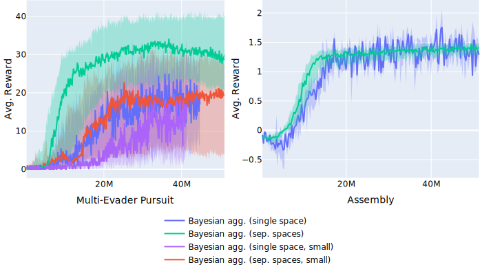

# Results {#sec:results}

In this section, we present the results of our experiments. We compare (1) the
training performance of the different aggregation methods on various tasks, (2)
aggregating different observation sets into a single vs multiple latent spaces
(3) various variants of Bayesian aggregation, and (4) the training algorithms
PPO and TRL.

In order to compare the performance of different variants, we consider the
average reward per episode over the agent steps used during training. This way
we can evaluate and compare the overall best results as well as the sample
efficiency.

Each policy gradient training step consists of multiple gradient descent steps
with a set of batches of trajectory rollouts generated using the previous
policy. We evaluate the performance after each training step on a separate set
of evaluation environments.

Unless mentioned otherwise, the following setup is used:

- The result plots show the median reward of the n runs at a specific training
  step, the error band is the 25th and 75th percentile of runs
- The activation function used after each layer is LeakyReLU
- For the Bayesian aggregation:
  - We only use the mean value $μ_z$ as an output, not $μ_z$ and $σ_z^2$
  - We use a single shared encoder for the value and confidence estimates
  - The a-priori estimate $μ_{z_0}$ is learnable separately for each feature
    dimension
  - The variance of the a-priori estimate as well as the encoded estimates are
    rectified using $\text{softplus}$.
- Multiple aggregatable groups are aggregated into separate latent spaces
- The parameters of the policy and value function are not shared
- The training algorithm used is PPO

Due to time and resource constraints, we only use individually hyper-parameter
optimized architectures on the multi-evader pursuit and rendezvous tasks, and
use the same architecture for all aggregation methods on the other tasks.

## Aggregation method results

We compare the performance of the different aggregation methods (Bayesian
aggregation, mean aggregation, attentive aggregation) on multiple tasks.

We use the notation `64-agg-64` to describe the layer sizes of the neural
network: The numbers before `agg` are the sequential layer sizes of the dense
layers of the encoders of each aggregation group. The numbers after `agg` are
the layer sizes in the decoder after the concatenation of the proprioceptive
observations with the aggregated observations (compare @fig:model).

We start with a very simple task (rendezvous), then look at progressively more
difficult tasks with more complex information that needs to be aggregated.

### Rendezvous task

The rendezvous task is very simple and thus gives a good baseline to show
whether our model works in general. It only has one simple aggregation group
(the agents).

@Fig:resrendezvous shows a comparison between mean and Bayesian aggregation on
the rendezvous task with twenty agents in a two-dimensional square world with
walls. The medium architecture is the one optimized on the pursuit task
(`120-60-agg-160`). The simple architecture is the one used in [@maxpaper]
(`64-agg-64`). The optimized architecture was optimized on the rendezvous task
with Bayesian aggregation directly: `146-120-agg-19-177-162`. All architectures
and aggregation methods successfully solve the task. The aggregation method does
not make any difference in the performance, but both the simple and the medium
architecture have a "drop" in training speed at around 2 million steps, while
the optimized architecture smoothly learns the problem. The logarithmic scale
graph to the right shows that while the simple and optimized architecture both
reach the same final score, the medium architecture never reaches the same
score. This might be because both the simple and the optimized architecture have
a bottleneck layer after the aggregation, forcing the neural network to simplify
the strategy.

We show a random exemplary episode of each a policy with median performance for
the medium and optimized architectures in @fig:rendezvouseg. For the medium
architecture case with the Bayesian aggregation, we notice that the consensus
location does not stay the same and instead drifts even after all agents are at
the same spot. In addition, sometimes there is one or more stragglers that take
significantly longer to get to the consensus location. For the medium
architecture with the mean aggregation, the agents do not converge on a single
point, but instead continue to circle a small area. For the optimized
architecture, the consensus is reached quickly (after 100 of 1000 time steps)
and stays at the same spot.

{#fig:resrendezvous}

{#fig:rendezvouseg}

<!--
{#fig:resrendezvouslog}

-->

### Single-evader pursuit task

The pursuit task is a slightly more complex task with the single evader being in
a second aggregation group with one observable. The results here show that the
learned policies can handle a moving object in the world and that the
architecture works with multiple observation groups.

@Fig:ressp shows the results on the single-evader pursuit task with 10 pursuers
and one evader. The neural network architecture is fixed at `120-60-agg-160` for
all methods. All methods learn the task quickly with the same best performance,
with the mean aggregation achieving the maximum performance slightly faster.
This shows that the task is simpler than the multi-evader pursuit task, even
though the policy architecture is the same. This is both due to the fact that
there are fewer evaders and that the reward is more sparse (minimum-distance for
single-evader vs count-catches for multi-evader).

{#fig:ressp}

### Multi-evader pursuit task

The multi-evader pursuit task adds complexity by having multiple evaders that
need to be caught. In addition, the reward is sparser due to the fact that each
catch only gives a binary reward signal. The results here show whether our
policy is able to process multiple aggregation groups with multiple moving
entities. Here, we consider the multi-evader pursuit task with 20 pursuers and 5
evaders on a torus. @Fig:resmpsmall shows the results of the multi-evader
pursuit task with different aggregation methods with the same architecture used
in [@maxpaper] to be able to directly compare the results. The architecture is
64-agg-64 with the tanh activation function. With this architecture, the
Bayesian aggregation performs best.

![Results on the multi-evader pursuit task with the NN architecture adapted from
[@maxpaper]. The Bayesian aggregation performs
best.](images/plots/2021-07-10_13.30.06-Multi-Evader Pursuit
(smallarch).svg){#fig:resmpsmall}

@Fig:resmpopt shows the results with neural network architectures that were
separately hyper-parameter optimized for each aggregation method except max
aggregation. The optimized architecture for the mean aggregation is
`174-226-97-agg-96`, the same architecture is used for the max aggregation. The
optimized architecture for the Bayesian aggregation is `120-60-agg-160`. The
optimized architecture for the attentive aggregation is `72-agg-132-200`. All
optimized architectures use the LeakyReLU activation functions. Note that the
architecture optimized on the mean aggregation is the deepest with three hidden
layers before the aggregation, while the optimized architecture on the attentive
aggregation has multiple layers after the aggregation instead. With the
hyper-parameter optimized architecture, the mean aggregation performs best. The
results are still similar when using the same `120-60-agg-160` architecture for
every aggregation method. The results of [@fig:resmpsmall; @fig:resmpopt]
indicate that the Bayesian aggregation outperforms the mean aggregation when the
neural network is limited in size, but has no advantage when the neural network
is sufficiently large and deep. The neural network seems to be able to
implicitly learn to transform and weigh the information from the different
observables, compensating the advantage of the additional structure of relevancy
/ certainty that is given in the Bayesian aggregation.

@Fig:resmpopttop shows the results of the top third of runs. The performance of
the mean and Bayesian aggregation is similar, indicating that the best runs are
similar, but that the Bayesian aggregation has more runs that fail to achieve
the peak performance.

@Fig:pursuiteg shows the first 500 steps of a random episode with the
medium-performing policy and the best-performing policy of each of the
aggregation methods. The mean aggregation tends to learn policies where first
all the evaders are forced to go to one location, then they are circled and
caught all at once. Since the evaders are algorithmically controlled and always
go to the largest free Voronoi region, the evaders naturally go to the same
location if they have enough space, so this strategy works well. The strategy of
the Bayesian aggregation policy seems to be more flexible, where different
groups of pursuers catch different groups of evaders at the same time instead of
all concentrating on a single cluster of evaders. This strategy does not lead to
better overall performance, however.

.svg){#fig:resmpopt}

.svg){#fig:resmpopttop}

{#fig:pursuiteg}

\FloatBarrier

### Assembly task

The assembly task is different from the previous tasks in that the agents have
to manipulate the environment in order reach their goal. In order to solve the
task, the agents need to show collaborative skills in deciding on the final
destination of the assembled cluster of objects as well as succeed in moving the
objects to that location. They also need to understand when the goal has been
reached in order to not move the boxes apart again. @Fig:resassembly shows the
results on the assembly task with ten agents and four boxes. The three
aggregation methods perform very similar, with the attentive aggregation
learning the task slightly quicker.

.svg){#fig:resassembly}

### Clustering task with two clusters

The clustering task is an extension of the assembly task with a _third_
aggregation group for the second cluster of objects. To successfully solve this
task, the agents need to be able to distinguish between the two object types and
split the work of moving them. @Fig:resclustering2 shows the results on the
clustering task with four boxes split into two clusters. The results are similar
in all cases, with all policies solving the task for most runs. An example of a
successful episode with mean aggregation is shown in @fig:clustering2.

.svg){#fig:resclustering2}

### Clustering task with three clusters

Doesn't work :(

## Learning algorithm comparison (PPO vs PG-TRL)

In multi-agent fully cooperative tasks, the reward can be even more sparse than
it is for single-agent tasks, since the same reward is used for all agents. One
agent can thus not know whether its own actions or the actions of a different
agent lead to a specific reward signal. Trust region layers policy gradient
(TRL) (see [@sec:trl]) was published for single-agent reinforcement learning,
but since TRL promises to improve the exploration over PPO and possibly find a
better optimal solution, we apply it to our multi-agent experiments in a direct
comparison to PPO.

In the following, we show some training graphs of the TRL training method
compared to PPO. @Fig:resmptrl shows the learning algorithm comparison on the
multi-evader pursuit task. The architectures are the ones hyper-parameter
optimized on PPO on each of the aggregation methods. TRL seems to show
significantly improved training performance for the Bayesian aggregation and
similar performance for the mean aggregation.

<!-- @Fig:resmptrltop
shows the same result for only the top one third of runs. The results are very
similar. This indicates that TRL makes the training more stable on this task,
fewer runs fail to achieve the optimal performance. -->

{#fig:resmptrl}

<!--
{#fig:resmptrltop}
-->

@Fig:ressptrl shows the comparison on the single-evader pursuit task. Here, the
performance of TRL is better than PPO on both the mean and the Bayesian
aggregation.

{#fig:ressptrl}

@Fig:resasstrl shows the comparison on the assembly task. All aggregation
methods perform the same, except the Bayesian aggregation with TRL, which is
worse.

.svg){#fig:resasstrl}

In summary, TRL seems to perform the same or better than PPO in most cases, with
the Bayesian aggregation on the assembly task being an outlier. Since we did not
do extensive testing with different hyper-parameters for TRL, we can conclude
that TRL may have good potential of performing better, in general, than PPO on
multi-task environments with sparse rewards.

\FloatBarrier

## Bayesian aggregation variants

In the results comparing the different aggregation methods above, we always use
the same setup for the Bayesian aggregation. The following shows the results for
some variants of the Bayesian aggregation on selected tasks.

### Single space vs separate space aggregation

For tasks where we have multiple aggregation groups, we can also aggregate all
observables into the same latent space instead of separate ones. This means that
instead of each aggregation space containing the information of those
aggregatables, the single aggregation space must contain the information of all
observables as it pertains to the current agent. The potential advantage is that
the policy can share more parameters and thus be more sample efficient. It can
also scale to a larger number of categories of objects (aggregation groups).
@Fig:sameseparate shows a schematic comparison between the two methods.

In the other experiments we always use separate spaces. @Fig:ressameseparate
shows the results of aggregating into a single space vs. into separate spaces
for the multi-evader pursuit and assembly tasks. In the case of the multi-evader
pursuit task single-space aggregation means that both the neighboring pursuers
and all the evaders are aggregated into one space. For the assembly task, both
the neighboring agents and the boxes are aggregated into one space. The
separate-space aggregation performs better in both tasks, with a higher margin
in the multi-evader task.

In summary, while the single-space aggregation is promising by in theory being
able to scale to more complex environment, it performs worse for our tasks. This
might be due to the fact that learning different encoder networks to output
information into the same latent space is hard. An alternative explanation might
be that our experiments only have few aggregation groups, so the value of
parameter sharing is low, or due to the lack of experiments with more different
hyper-parameters.

{#fig:sameseparate}

{#fig:ressameseparate}

<!--
{#fig:ressameseparate}

{#fig:ressameseparate2}

-->

### Separate vs common encoder

As described in @sec:bayesianagg, we can either have a shared encoder to predict
the mean and variance of each sample in each aggregation space by making the
last layer of the encoder have two outputs for each feature, or have two fully
separate networks ($enc_r$ and $enc_σ$). In our experiments, using one common
encoder with two outputs generally performs better.

### Using the aggregated variance or only the mean

In the other experiments with Bayesian aggregation, we only use the predicted
mean of the Gaussian distribution of each latent space feature as an input to
the decoder:

$$e_{k→G}=μ_z$$

Since the Bayesian aggregation also gives us a full a-posteriori Gaussian
distribution, we also have an estimate of the variance for each feature in the
latent space that is computed from the apriori variance conditioned on each seen
latent space sample. We can feed this variance to the decoder by concatenating
it with the mean predictions in the hope that the neural network is able to use
this additional information:

$$e_{k→G}=(μ_z, σ_z^2)$$

The results of applying this method to the multi-evader pursuit are seen in
@fig:resoutputvariance. The neural network architecture is the same as for the
other experiments with Bayesian aggregation on multi-evader pursuit
(`120-60-agg-160`). Including the variance in the decoder inputs decreases the
performance.

The decreasing performance could be a result of the increased dimension of the
decoder inputs. Adding the variance inputs doubles the number of values the
decoder has to process and learn from. Since the structure of the encoded values
and variances can not be known beforehand to the decoder, it has to learn to
interpret more information than when receiving just the mean values. The added
variance inputs should give the decoder the ability to understand the confidence
of each of the value predictions and weigh them accordingly, but the added
complexity seems to make it not worth it.

.svg){#fig:resoutputvariance}

<!-- ### Local obs aggregation space -->

<!-- ### Activation functions

(probably uninteresting)

-->
